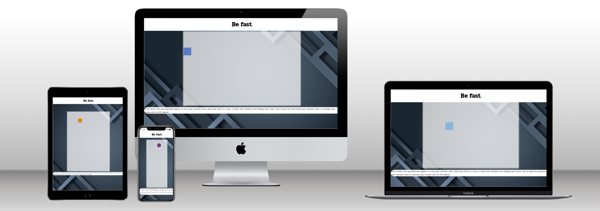
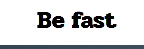
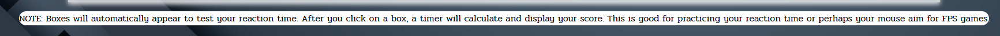
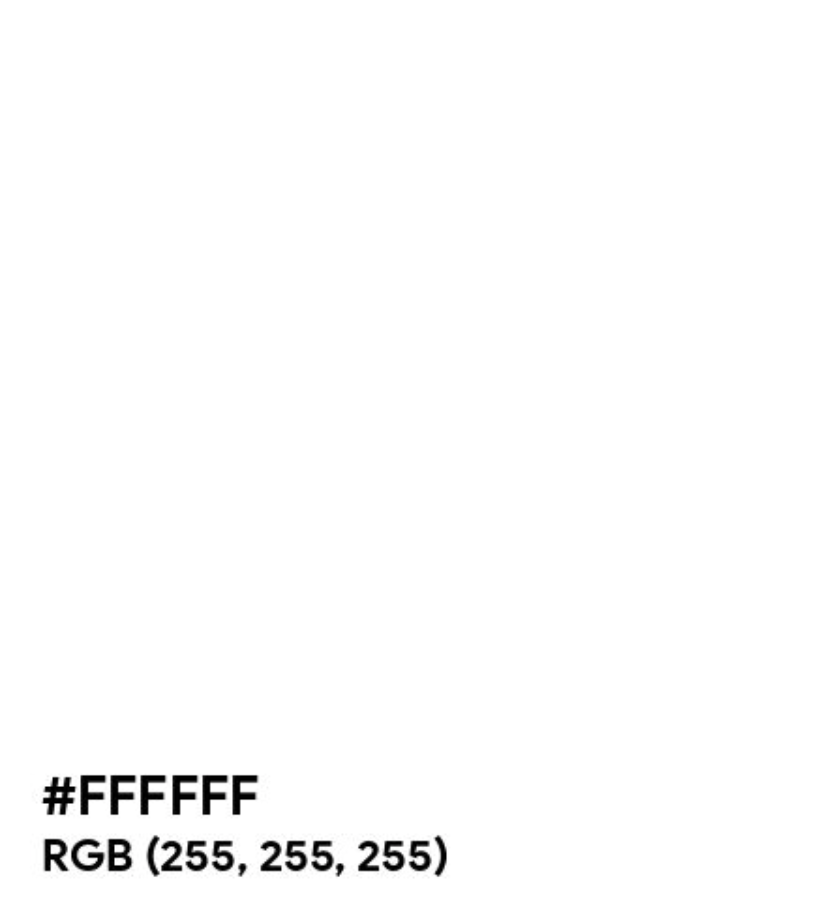
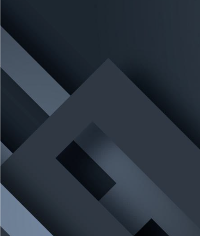
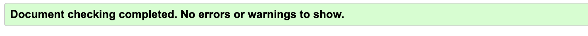
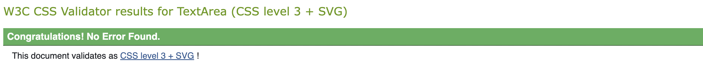
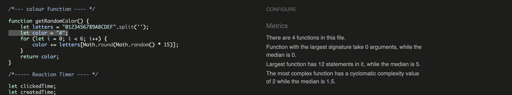
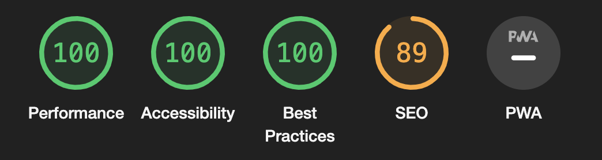

[View deployed site here](https://odmarken.github.io/BeFast/)

# Be Fast Reflex Game

## Overview
Welcome to Be Fast! This engaging and fast-paced game is meticulously designed to test and improve your reaction speeds in a fun and challenging way. As you play, uniformly sized boxes will randomly appear on different parts of the screen. Your task is simple yet challenging: click on these boxes as quickly as possible before they disappear. Each box can appear at any moment, with intervals varying randomly between 0 to 1000 milliseconds. This setup continuously challenges your reflexes without the complexity of levels or scoring. Dive into Be Fast and challenge yourself to maintain precision and speed over a prolonged period. Perfect for players of all ages seeking to sharpen their sensory skills and reaction times in an exciting, interactive format.

## Features
- **Dynamic Difficulty:** The game is fast paced, with boxes appearing more rapidly.
- **Score Tracking:** Your reaction times are recorded, allowing you to track your improvement.
- **User-Friendly Interface:** A clean and intuitive interface ensures you can focus on the game without distractions.

## How to Play
1. **Start the Game:** The game start automatically.
2. **Click the Boxes:** Boxes will appear at random positions on the screen. Click them as quickly as you can.
3. **Keep an Eye on the Timer:** The game records your reaction time for each box.

## User Experience (UX) 

### Visitor goals

| **User stories**                                                                                          |
|-----------------------------------------------------------------------------------------------------------|
| As a user, I want to easily understand the main purpose of the site                                       |
| As a user, I want to have a better how the game works                                                     |
| As a user, I want to get a better understanding how to complete the challange                             |
|-----------------------------------------------------------------------------------------------------------|

## Features

1.	**Title**  
    
    The title stays clean and understandable so the user can instantly see what it means and recognize it.

    

2.	**Notes/Rules**  

     The Notes section offers a straightforward rule to follow and explains how to play the game.
   
    
    

3.	**Game**  
    
    The game is a reaction-type game that will challenge you to the edges, perfect for reflex practice or for gamers who want to improve their aim in FPS shooting games.

    

## Design

### Colours

The color design I have been using is black, white, and red, with a graphic background to make it more 'game-like'. I have added a shadow to the playground to sometimes make the game boxes hard to see, increasing the challenge.

### Typography

In this project Ive used [Pridi](https://fonts.google.com/specimen/Pridi)
from google font [Google fonts](https://fonts.google.com/)

## Technologies and tools used

- [HTML5](https://en.wikipedia.org/wiki/HTML5)
- [CSS3](https://en.wikipedia.org/wiki/CSS)
- [JavaScript](https://it.wikipedia.org/wiki/JavaScript)
- Version control: [Git](https://git-scm.com/)
- Public repository: [GitHub](https://github.com/)
- [Google Fonts:](https://fonts.google.com/) font used is "Pridi".
- [Font Awesome:](https://fontawesome.com/) is used on header and form sign up and also footer.
- Lighthouse: [Lighthouse](https://developer.chrome.com/docs/lighthouse/overview/)
- Free Images: [Pexels](https://www.pexels.com/search/website%20background/)

### HTML validation

### CSS validation

### JS validation 

### Lighthouse testing

### Browser compatibility

- I have rigorously tested the website on various browsers, including Firefox, Safari, Chrome, and Opera GX, and they all work flawlessly.
- I've tested it on different devices such as phones, tablets, a MacBook Pro, Windows 11, and also an iMac.
- Additionally, I have tested the website using Chrome's developer tools to ensure it functions correctly across all resolutions, including the iMac Pro's 5120 x 2880 resolution.
- Navigation elements are placed in their appropriate locations throughout the website.
- Footer navigation elements are correctly positioned where they belong, and they open in a new browser tab.
- The form accurately validates fields that are marked as required, ensuring no essential information is omitted.
- The form also checks the format of email addresses, confirming they adhere to the standard email structure.
- All data entered into the form is successfully transmitted to the designated formdump for processing and storage.

- Chrome
- Safari
- Firefox
- Opera GX

## Testing

1. [HTML validation](#html-validation)
2. [CSS validation](#css-validation)
3. [JavaScript validation](#js-validation)
4. [Lighthouse testing](#lighthouse-testing)
5. [Browsers compatibility](#browser-compatibility)

## Deployment

I've deployed the website on GitHub Pages.

- In the GitHub repository, navigate to the Settings tab, choose Pages from the left hand menu 
- From the source section drop-down menu, select the Master Branch once the master branch has been selected, the page will be automatically refreshed with a detailed display to indicate the successful deployment
- Changes pushed to the master branch will take effect on the live project

[Be Fast](https://odmarken.github.io/BeFast/) 

## Bugs and known issues

- The scaling for the game boxes sometimes bugs out when reduced to under 368 pixels.

## Coding help

- I received a lot of help from the lovely community at CI Community-Sweden. The Slack group has been amazing when it comes to assistance. Every time I have been stuck, they have responded within minutes. We also have multiple huddles that helps a lot from experienced coders.

- Youtube.
- Google
- Close friends

## Credits

- Slack group community-sweden in CI slack group.
- Brian my mentor.
- Jonahatan in community-sweden ex CI student.
- Insperation https://www.youtube.com/watch?v=tTO1GyOjaI0&t=1099s 
- coding help https://www.youtube.com/@webbskolan in swedish

