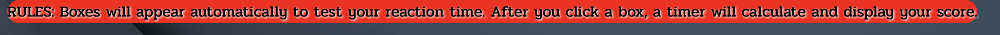

[View deployed site here](https://odmarken.github.io/BeFast/)

# Be Fast Reflex Game

## Overview
Welcome to Be Fast! This engaging and fast-paced game is meticulously designed to test and improve your reaction speeds in a fun and challenging way. As you play, uniformly sized boxes will randomly appear on different parts of the screen. Your task is simple yet challenging: click on these boxes as quickly as possible before they disappear. Each box can appear at any moment, with intervals varying randomly between 0 to 6000 milliseconds. This setup continuously challenges your reflexes without the complexity of levels or scoring. Dive into Be Fast and challenge yourself to maintain precision and speed over a prolonged period. Perfect for players of all ages seeking to sharpen their sensory skills and reaction times in an exciting, interactive format.

## Features
- **Dynamic Difficulty:** The game is fast paced, with boxes appearing more rapidly.
- **Score Tracking:** Your reaction times are recorded, allowing you to track your improvement.
- **User-Friendly Interface:** A clean and intuitive interface ensures you can focus on the game without distractions.

## How to Play
1. **Start the Game:** The game start automatically.
2. **Click the Boxes:** Boxes will appear at random positions on the screen. Click them as quickly as you can.
3. **Keep an Eye on the Timer:** The game records your reaction time for each box.

## User Experience (UX) 

### Visitor goals

| **User stories**                                                                                          |
|-----------------------------------------------------------------------------------------------------------|
| As a user, I want to easily understand the main purpose of the site                                       |
| As a user, I want to have a better how the game works                                                     |
| As a user, I want to get a better understanding how to complete the challange                             |
|-----------------------------------------------------------------------------------------------------------|

## Features

1.	**Title**  
    
    The title stays clean and understandable so the user can instantly see what it means and recognize it.

    

2.	**Heading/Rules**  

     The heading provides a simple statement and shows you how to react, while the Rules section offers a straightforward rule to follow and explains how to play the game.
   
    
    

3.	**Game**  
    
    The game is a reaction-type game that will challenge you to the edges, perfect for reflex practice or for gamers who want to improve their aim in FPS shooting games.

    

## Design

### Colours

The color design I have been using is black, white, and red, with a graphic background to make it more 'game-like'. I have added a shadow to the playground to sometimes make the game boxes hard to see, increasing the challenge.

### Typography

In this project Ive used ('https://fonts.googleapis.com/css2?family=Pridi:wght@200;300;400;500;600;700&display=swap') 
from google font [View deployed site here](https://fonts.google.com/)

## Technologies and tools used

- [HTML5](https://en.wikipedia.org/wiki/HTML5)
- [CSS3](https://en.wikipedia.org/wiki/CSS)
- [JavaScript](https://it.wikipedia.org/wiki/JavaScript)
- Version control: [Git](https://git-scm.com/)
- Public repository: [GitHub](https://github.com/)
- Google Font: [Open Sans](https://fonts.google.com/specimen/Open+Sans)
- Lighthouse: [Lighthouse](https://developer.chrome.com/docs/lighthouse/overview/)
- Free Images: [Pexels](https://www.pexels.com/search/website%20background/)
