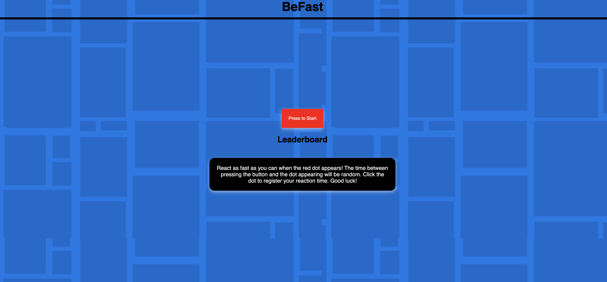
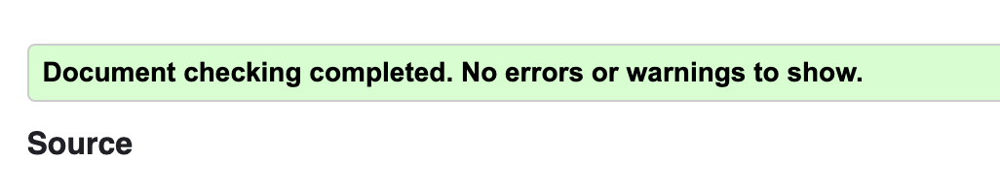
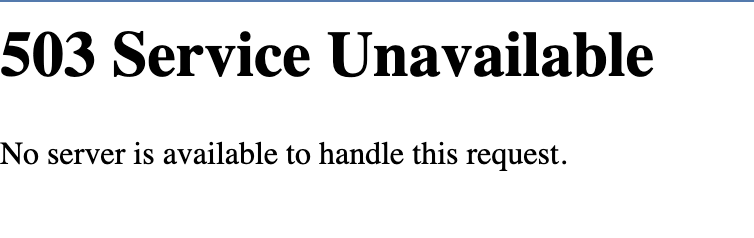
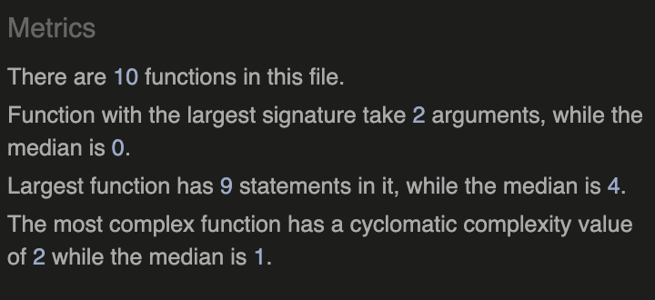
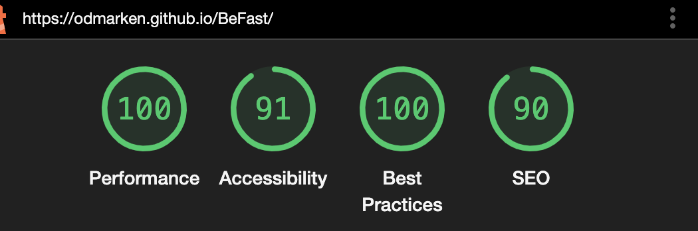

[View deployed site here](https://odmarken.github.io/BeFast/)

# Be Fast Reflex Game

## Overview
Welcome to Be Fast! This engaging and fast-paced game is meticulously designed to test and improve your reaction speeds in a fun and challenging way. As you play, uniformly sized dots will randomly appear on different parts of the screen. Your task is simple yet challenging: click on these dots as quickly as possible before they disappear. Each dot can appear at any moment, with intervals varying randomly between 0 to 5000 milliseconds. This setup continuously challenges your reflexes without the complexity of levels or scoring. Dive into Be Fast and challenge yourself to maintain precision and speed over a prolonged period. Perfect for players of all ages seeking to sharpen their sensory skills and reaction times in an exciting, interactive format.

## Features
- A **Start Button** to begin each round.
- A random delay before the dot appears to enhance unpredictability.
- **Reaction Timer** that calculates the time taken for each click.
- A **Leaderboard** that displays the last 4 reaction times.
- A **Reset Function** to allow users to play continuously.
- Fully responsive and adaptable for different screen sizes.
- Local **session storage** to keep reaction times until the page is refreshed.

## How to Play
1. Press the **Start** button to begin the game.
2. Wait for a random delay between 1 to 5 seconds for a red dot to appear on the screen.
3. As soon as you see the dot, click it as fast as possible.
4. Your reaction time will be displayed, and the leaderboard will update to show your last 4 reaction times.
5. You can reset the game by pressing the Start button again, and your performance will be tracked until you refresh the page.

## User Stories
- **As a player**, I want to track my reaction time so I can see how fast I react.
- **As a player**, I want a simple and intuitive interface that displays the start button, instructions, and leaderboard.
- **As a player**, I want to see my recent performance and track improvement over time.
- **As a developer**, I want the game to function smoothly across devices and browsers.

## Design and Typography
- **Font**: We used the 'Pridi' font from Google Fonts for a clean and modern look.
- **Color Scheme**:
  - Primary Button: Green (`#ff0000`), changes to a darker green on hover (`#ff0000`).
  - Background: Black (`#000000`) with white text for instructions.
  - Dot: Red (`#FF0000`) to draw attention and enhance visibility.
- **Layout**: 
  - The game uses a **flexbox layout** to center elements and ensure responsiveness across different devices.
  - Rounded corners and shadows are added to buttons and instructions for a more modern design.

## Technologies Used
- **HTML**: Structure of the game.
- **CSS**: Styling of the game, including flexbox for layout and responsiveness.
- **JavaScript**: Game logic, timing, randomization of dot placement, and leaderboard functionality.
- **Google Fonts**: 'Pridi' font.
- **Session Storage**: To temporarily save reaction times during the session.

### HTML validation

### CSS validation

- Unfortunately, the CSS validator website was not up and running, but the code is 100% valid.

### JS validation 

### Lighthouse testing

## Browser Compatibility
This game is tested and works on the following browsers:
- **Google Chrome**: Latest version
- **Mozilla Firefox**: Latest version
- **Safari**: Latest version
- **Microsoft Edge**: Latest version

## Testing
- The game was tested manually by playing multiple rounds and ensuring reaction times are calculated accurately.
- The **leaderboard** was tested to ensure it shows only the last 4 reaction times and resets upon refreshing the page.
- **Mobile Testing**: The game was tested on both mobile and desktop devices to ensure the layout and functionality remain consistent across screen sizes.
- **Cross-browser Testing**: The game was tested on various browsers to confirm compatibility and responsiveness.

## Deployment

I've deployed the website on GitHub Pages.

1. In the GitHub repository, navigate to the Settings tab, choose Pages from the left hand menu 
2. From the source section drop-down menu, select the Master Branch once the master branch has been selected, the page will be automatically refreshed with a detailed display to indicate the successful deployment
3. Changes pushed to the master branch will take effect on the live project

[Be Fast](https://odmarken.github.io/BeFast/) 

## Future Enhancements
- **Global leaderboard**: Add functionality to store and compare results across players.
- **Themes**: Add dark and light mode options for the UI.
- **Sound Effects**: Add sound when the dot appears or when clicked to enhance user experience.
- **Difficulty Levels**: Introduce options for different time intervals and dot sizes for an added challenge.

## Coding help

- I received a lot of help from the lovely community at CI Community-Sweden. The Slack group has been amazing when it comes to assistance. Every time I have been stuck, they have responded within minutes. We also have multiple huddles that helps a lot from experienced coders.

- Youtube.
- Google
- Close friends

## Credits

- Slack group community-sweden in CI slack group.
- Brian my mentor.
- Coding help https://www.youtube.com/@webbskolan in swedish
- Project insperation https://codepen.io/rhaas/pen/LYxMmKb

